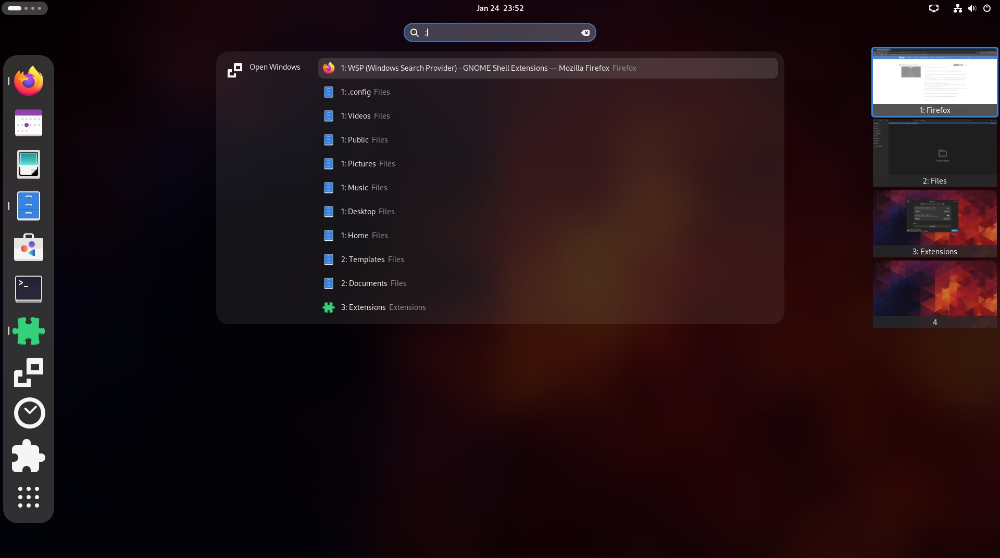

# WSP (Windows Search Provider)
A GNOME Shell extension that allows you to search open windows from the overview.

This extensions has been originally crated as a module for the V-Shell extension.

### Supported GNOME Shell versions
45, 46



## How to use WSP
1.  Open the overview (press and release the Super key or trigger the hot corner)
2.  a) Type the name of the extension you are looking for; 5 first results will be added to the global search<br>
    b) Type `wq//`, `qqw` or ``` ` ```/`;`/`|` (usually the key above Tab) to list all open windows. You can continue typing a string from the window title or app name to filter the list<br>
3.  a) Activate the search result to activate the window<br>
    b) Activate the search result while holding down the *Shift* key to move the window to the current workspace and activate it
    c) Activate the search result while holding down the *Ctrl* and *Shift* keys to move all results to the current workspace and activate the activated window

## Installation
### Installation from GitHub repository
You may need to install `git`, `make`, `gettext` and `glib2.0` for successful installation.
Navigate to the directory you want to download the source code and execute following commands in the terminal:

#### GNOME 45+

    git clone https://github.com/G-dH/windows-search-provider.git
    cd windows-search-provider
    make install

#### GNOME 42-44

    git clone https://github.com/G-dH/windows-search-provider.git
    cd windows-search-provider
    git checkout gnome-42-44
    make install

### Enabling the extension
After installation you need to enable the extension.

- First restart GNOME Shell (`ALt` + `F2`, `r`, `Enter`, or Log-Out/Log-In if you use Wayland)
- Now you should see the *WSP (Windows Search Provider)* extension in the *Extensions* application (reopen the app if needed to load new data), where you can enable it.

## Buy me a coffee
If you like my extensions and want to keep me motivated give me some useful feedback, but you can also help me with my coffee expenses:
[buymeacoffee.com/georgdh](https://buymeacoffee.com/georgdh)
