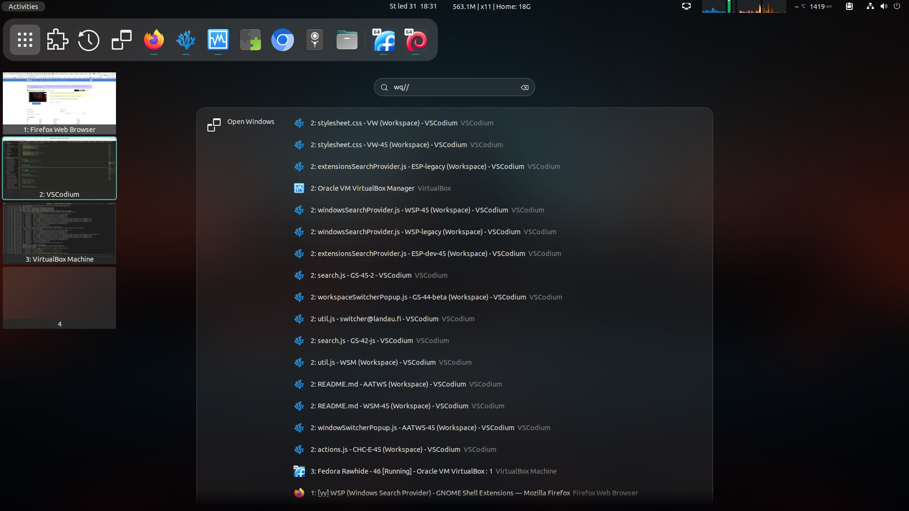

# WSP (Windows Search Provider)
A GNOME Shell extension that allows you to search and organize open windows from the overview.

WSP is supported by the V-Shell extension which allows you to toggle the window search using the Space key in activities overview or by clicking on the dedicated icon in the dash.

### Supported GNOME Shell versions
42 - 46

## Features
- Open windows can be added to the top of the global search results
- Adding a customizable prefix in front of the search pattern allows you to display an isolated window search view with a complete list of open windows
- Strict, Fuzzy and RegExp search methods
- Close and move windows between workspaces
- Close and move commands can be added at the end of the search pattern
- Sorting options for the complete list of open windows


[](https://extensions.gnome.org/extension/6730/)



## How to use WSP
1.  Open the overview (press and release the Super key or trigger the hot corner)
2.  a) Type any part (or multiple parts separated by space) of the name of the extension you are looking for; 5 first results will be added to the global search<br>
    b) Type search prefix (default `wq//`, `qqw` or ``` ` ```/`;`/`|` (usually the key above Tab)) to list all open windows. You can continue typing a string from the window title or app name to filter the list<br>
3.  a) Activate the search result to activate the window<br>
    b) Activate the search result while holding down the *Shift* key to move the window to the current workspace and activate it
    c) Activate the search result while holding down the *Ctrl* and *Shift* keys to move all results to the current workspace and activate the activated window

## Search methods
Four options are available:

- **Strict** - strict match, but case and accent insensitive and you can enter multiple strings separated by a space in arbitrary order
- **Fuzzy** - same as Strict except you can skip letters in individual strings. So you can find "Firefox" even if you enter "ffx"
- **Regular Expression Case Sensitive** - the search pattern is used as the JavaScript RegExp
- **Regular Expression Case Insensitive** - the search pattern is used as the JavaScript RegExp with the `i` flag

## Commands
You can use all the features even without the mouse by adding a short command after the search pattern and a space.

Available commands:

| Command    | Description                                                                |
|------------|----------------------------------------------------------------------------|
| /x!         | Close selected window                                                     |
| /xa!        | Close all search results                                                  |
| /m[index]   | i.e. `/m4` Move selected window to the workspace with the given index     |
| /ma[index]  | i.e. `/ma4` Move all search results to the workspace with the given index |

## Modifier keys
Use modifier keys to alter the default behavior of result activation

| Modifier      | Description                                                                              |
|---------------|------------------------------------------------------------------------------------------|
| `Shift`       | Move activated window to current workspace and activate it                               |
| `Shift + Ctrl`| Move all search results to the current workspace and activate the activated window       |
| `Alt`         | If a command is used, holding the Alt key disables closing the overview after activation |


## Installation
### Installation from extensions.gnome.org
The easiest way to install WSP: go to [extensions.gnome.org](https://extensions.gnome.org/extension/6730/) and toggle the switch. This installation also gives you automatic updates in the future.

### Installation from GitHub repository
The latest development version
You may need to install `git`, `make`, `gettext` and `glib2.0` for successful installation.
Navigate to the directory you want to download the source code and execute following commands in the terminal:

#### GNOME 45+

    git clone https://github.com/G-dH/windows-search-provider.git
    cd windows-search-provider
    make install

#### GNOME 42-44

    git clone https://github.com/G-dH/windows-search-provider.git
    cd windows-search-provider
    git checkout gnome-42-44
    make install

### Enabling the extension
After installation you need to enable the extension.

- First restart GNOME Shell (`ALt` + `F2`, `r`, `Enter`, or Log-Out/Log-In if you use Wayland)
- Now you should see the *WSP (Windows Search Provider)* extension in the *Extensions* application (reopen the app if needed to load new data), where you can enable it.

## Buy me a coffee
If you like my extensions and want to keep me motivated give me some useful feedback, but you can also help me with my coffee expenses:
[buymeacoffee.com/georgdh](https://buymeacoffee.com/georgdh)
